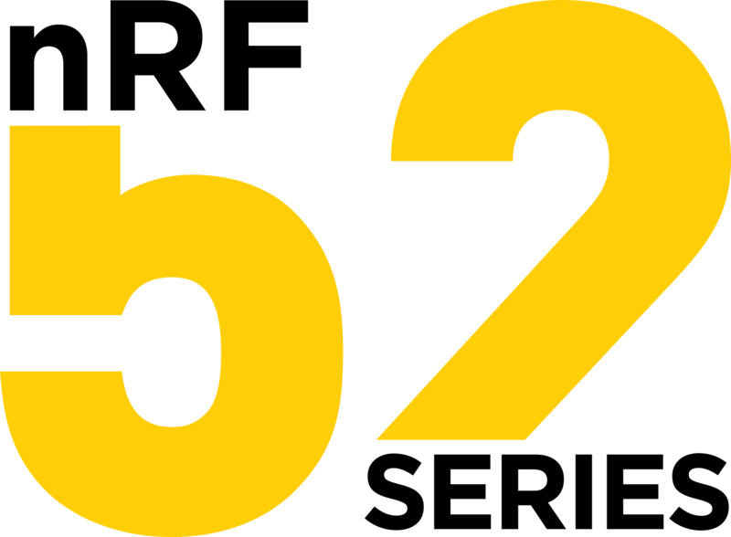
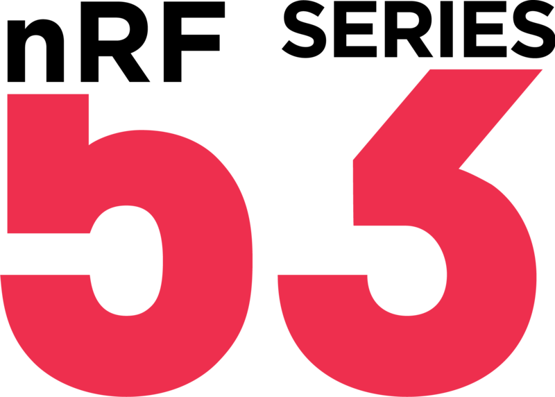
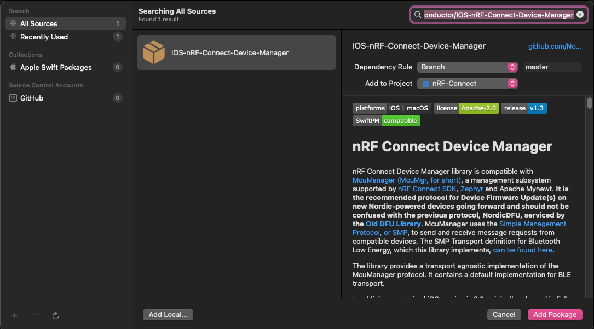

[](https://github.com/NordicSemiconductor/IOS-nRF-Connect-Device-Manager/blob/master/LICENSE)
[](https://github.com/NordicSemiconductor/IOS-nRF-Connect-Device-Manager/releases)
[](https://swift.org/package-manager/)

# nRF Connect Device Manager

nRF Connect Device Manager library is compatible with [McuManager (McuMgr, for short)](https://docs.zephyrproject.org/3.2.0/services/device_mgmt/mcumgr.html#overview), a management subsystem supported by [nRF Connect SDK](https://developer.nordicsemi.com/nRF_Connect_SDK/doc/latest/nrf/index.html), [Zephyr](https://docs.zephyrproject.org/3.2.0/introduction/index.html) and Apache Mynewt.  **It is the recommended protocol for Device Firmware Update(s) on new Nordic-powered devices going forward and should not be confused with the previous protocol, NordicDFU, serviced by the [Old DFU Library](https://github.com/NordicSemiconductor/IOS-DFU-Library)**. McuManager uses the [Simple Management Protocol, or SMP](https://docs.zephyrproject.org/3.2.0/services/device_mgmt/smp_protocol.html), to send and receive message requests from compatible devices. The SMP Transport definition for Bluetooth Low Energy, which this library implements, [can be found here](https://docs.zephyrproject.org/latest/services/device_mgmt/smp_transport.html).

The library provides a transport agnostic implementation of the McuManager protocol. It contains a default implementation for BLE transport.

> Minimum required iOS version is 9.0, originally released in Fall of 2015.

### Note

This repository is a fork of the [McuManager iOS Library](https://github.com/JuulLabs-OSS/mcumgr-ios), which is no longer being supported by its original maintainer. As of 2021, we have taken ownership of the library, so all new features and bug fixes will be added here. Please, migrate your projects to point to this Git repsository in order to get future updates. See [migration guide](https://github.com/NordicSemiconductor/Android-nRF-Connect-Device-Manager#migration-from-the-original-repo).

## Compatible Devices

| nRF52 Series | nRF53 Series | nRF91 Series |
| :---: | :----: | :---: |
|  |  |  |

This library is designed to work with the SMP Transport over BLE. It is implemented and maintained by Nordic Semiconductor, **but it should work any devices communicating via SMP Protocol**. If you encounter an issue communicating with a device using any chip, not just Nordic, please file an Issue.

## Library Adoption into an Existing Project (Install)

### SPM or Swift Package Manager (Recommended)

In Xcode, open your root Project file. Then, switch to the *Package Dependencies* Tab, and hit the *+* button underneath your list of added Packages. A new modal window will pop-up. On the upper-right corner of this new window, there's a search box. Paste the URL for this GitHub project `https://github.com/NordicSemiconductor/IOS-nRF-Connect-Device-Manager` and the *Add Package* button should enable.



After Xcode fetches your new project dependency, you should now be able to add `import iOSMcuManagerLibrary` to the Swift files from where you'd like to call upon this library. And you're good to go.

### CocoaPods

```
pod 'iOSMcuManagerLibrary'
```

## Building the Example Project (Requires Xcode & CocoaPods)

### "Cocoapods?"

Not to worry, we have you covered. Just [follow the instructions here](https://guides.cocoapods.org/using/getting-started.html).

### Instructions

First, clone the project:

```shell
git clone https://github.com/NordicSemiconductor/IOS-nRF-Connect-Device-Manager.git
```

Then, open the project's directory, navigate to the *Example* folder, and run `pod install`:

```shell
cd IOS-nRF-Connect-Device-Manager/
cd Example/
pod install
```

The output should look similar to this:

```shell
Analyzing dependencies
Downloading dependencies
Installing SwiftCBOR (0.4.4)
Installing ZIPFoundation (0.9.11)
Installing iOSMcuManagerLibrary (1.3.1)
Generating Pods project
Integrating client project
Pod installation complete! There are 2 dependencies from the Podfile and 3 total pods installed.
```

You should now be able to open, build & run the Example project by opening the *nRF Connect Device Manager.xcworkspace* file:

```shell
open nRF\ Connect\ Device\ Manager.xcworkspace
```

# Introduction

McuManager is an application layer protocol used to manage and monitor microcontrollers running Apache Mynewt and Zephyr. More specifically, McuManagr implements over-the-air (OTA) firmware upgrades, log and stat collection, and file-system and configuration management.

## Command Groups

McuManager are organized by functionality into command groups. In _mcumgr-ios_, command groups are called managers and extend the `McuManager` class. The managers (groups) implemented in _mcumgr-ios_ are:

* **`DefaultManager`**: Contains commands relevant to the OS. This includes task and memory pool statistics, device time read & write, and device reset.
* **`ImageManager`**: Manage image state on the device and perform image uploads.
* **`StatsManager`**: Read stats from the device.
* **`ConfigManager`**: Read/Write config values on the device.
* **`LogManager`**: Collect logs from the device.
* **`CrashManager`**: Run crash tests on the device.
* **`RunTestManager`**: Runs tests on the device.
* **`FileSystemManager`**: Download/upload files from the device file system.
* **`BasicManager`**: Send 'Erase App Settings' command to the device.

# Firmware Upgrade

Firmware upgrade is generally a four step process performed using commands from the `image` and `default` commands groups: `upload`, `test`, `reset`, and `confirm`.

This library provides a `FirmwareUpgradeManager` as a convinience for upgrading the image running on a device. 

## FirmwareUpgradeManager

A `FirmwareUpgradeManager` provides an easy way to perform firmware upgrades on a device. A `FirmwareUpgradeManager` must be initialized with an `McuMgrTransport` which defines the transport scheme and device. Once initialized, a `FirmwareUpgradeManager` can perform one firmware upgrade at a time. Firmware upgrades are started using the `start(data: Data)` method and can be paused, resumed, and canceled using `pause()`, `resume()`, and `cancel()` respectively.

### Legacy / App Core-Only Upgrade Example
```swift
// Initialize the BLE transporter using a scanned peripheral
let bleTransport = McuMgrBleTransport(cbPeripheral)

// Initialize the FirmwareUpgradeManager using the transport and a delegate
let dfuManager = FirmwareUpgradeManager(bleTransport, delegate)

// Start the firmware upgrade with the image data
dfuManager.start(data: imageData)
```

**Note**: Always make your start/pause/cancel DFU API calls from the Main Thread.

### Multi-Image DFU Example
```swift
extension ImageManager {
    
    public typealias Image = (image: Int, data: Data)

    [...]
}
```

The above is the input format for Multi-Image DFU call, where an input of `0` for the `image` parameter means **App Core**, and an input of `1` means **Net Core**. These assignments are of course subject to change as we expand the capabilities of our products.

With this, it's straightforward to make a call to start DFU for either or both cores:

```swift
// Initialize the BLE transporter using a scanned peripheral
let bleTransport = McuMgrBleTransport(cbPeripheral)

// Initialize the FirmwareUpgradeManager using the transport and a delegate
let dfuManager = FirmwareUpgradeManager(bleTransport, delegate)

// Build Multi-Image DFU parameters
let images: [ImageManager.Image] = [
    (image: 0, data: appCoreData), // App Core
    (image: 1, data: netCoreData) // Net Core
]

// Start Multi-Image DFU firmware upgrade
dfuManager.start(images: images)
```

### Multi-Image DFU Format

Usually, when performing Multi-Image DFU, the delivery format of the attached images for each core will be in a `.zip` file. This is because the `.zip` file allows us to bundle the necessary information, including the images for each core and which image should be uploaded to each core. This association between the image files, usually in `.bin` format, and which core they should be uploaded to, is written in a mandatory JSON format called the Manifest. This `manifest.json` is generated by our nRF Connect SDK as part of our Zephyr build system, [as documented here](https://developer.nordicsemi.com/nRF_Connect_SDK/doc/latest/nrf/app_dev/build_and_config_system/index.html). You can look at the `McuMgrManifest` struct definition within the library for an insight into the information contained within the manifest.

Now, the issue is that there's a gap between the aforementioned API, and the output from our Zephyr build system, which is a `.zip` file. To bridge this gap, we wrote `McuMgrPackage`, which takes a `URL` in its `init()` function. So, given the `URL` to the `.zip` file, it is possible to start Multi-Image DFU like this:

```swift
do {
    // Initialize the BLE transporter using a scanned peripheral
    let bleTransport = McuMgrBleTransport(cbPeripheral)

    // Initialize the FirmwareUpgradeManager using the transport and a delegate
    let dfuManager = FirmwareUpgradeManager(bleTransport, delegate)

    // Read Multi-Image DFU package
    let dfuPackage = try McuMgrPackage(from: dfuPackageUrl)

    // Start Multi-Image DFU firmware upgrade
    dfuManager.start(images: dfuPackage.images)
} catch {
    // try McuMgrPackage(from:) will throw McuMgrPackage.Error(s) here.
}
```

Have a look at `FirmwareUpgradeViewController.swift` from the Example project for a more detailed usage sample.

### Firmware Upgrade Mode

McuManager firmware upgrades can actually be performed in few different ways. These different upgrade modes determine the commands sent after the `upload` step. The `FirmwareUpgradeManager` can be configured to perform these upgrade variations by setting the `mode` property in `FirmwareUpgradeManager`. The different firmware upgrade modes are as follows:

* **`.testAndConfirm`**: This mode is the **default and recommended mode** for performing upgrades due to it's ability to recover from a bad firmware upgrade. The process for this mode is `upload`, `test`, `reset`, `confirm`. 
* **`.confirmOnly`**: This mode is **not recommended, except for Multi-Image DFU where it is the only supported mode**. If the device fails to boot into the new image, it will not be able to recover and will need to be re-flashed. The process for this mode is `upload`, `confirm`, `reset`.
* **`.testOnly`**: This mode is useful if you want to run tests on the new image running before confirming it manually as the primary boot image. The process for this mode is `upload`, `test`, `reset`.

### Firmware Upgrade State

`FirmwareUpgradeManager` acts as a simple, mostly linear state machine which is determined by the `mode`. As the manager moves through the firmware upgrade process, state changes are provided through the `FirmwareUpgradeDelegate`'s `upgradeStateDidChange` method.

The `FirmwareUpgradeManager` contains an additional state, `validate`, which precedes the upload. The `validate` state checks the current image state of the device in an attempt to bypass certain states of the firmware upgrade. For example, if the image to upgrade to already exists in slot 1 on the device, the `FirmwareUpgradeManager` will skip `upload` and move directly to `test` (or `confirm` if `.confirmOnly` mode has been set) from `validate`. If the uploaded image is already active, and confirmed in slot 0, the upgrade will succeed immediately. In short, the `validate` state makes it easy to reattempt an upgrade without needing to re-upload the image or manually determine where to start.

### Firmware Upgrade Configuration


In version 1.2, new features were introduced to speed-up the Upload speeds, mirroring the work first done on the Android side, and they're all available through the new `FirmwareUpgradeConfiguration` struct.

* **`pipelineDepth`**: (Represented as 'Number of Buffers' in the Example App UI.) For values larger than 1, this enables the **SMP Pipelining** feature. It means multiple write packets are sent concurrently, thereby providing a large speed increase the higher the number of buffers the receiving device is configured with. Set to `1` (Number of Buffers = Disabled) by default. 
* **`byteAlignment`**: This is required when used in conjunction with SMP Pipelining. By fixing the size of each chunk of Data sent for the Firmware Upgrade, we can predict the receiving device's offset jumps and therefore smoothly send multiple Data packets at the same time. When SMP Pipelining is not being used (`pipelineDepth` set to `1`), the library still performs Byte Alignment if set, but it is not required for updates to work. Set to `ImageUploadAlignment.disabled` by default.
* **reassemblyBufferSize**: SMP Reassembly is another speed-improving feature. It works on devices running NCS 2.0 firmware or later, and is self-adjusting. Before the Upload starts, a request is sent via `DefaultManager` asking for MCU Manager Paremeters. If received, it means the firmware can accept data in chunks larger than the MTU Size, therefore also increasing speed. This property will reflect the size of the buffer on the receiving device, and the `McuMgrBleTransport` will be set to chunk the data down within the same Sequence Number, keeping each packet transmission within the MTU boundaries. **There is no work required for SMP Reassembly to work** - on devices not supporting it, the MCU Manager Paremeters request will fail, and the Upload will proceed assuming no reassembly capabilities.
* **`eraseAppSettings`**: This is not a speed-related feature. Instead, setting this to `true` means all app data on the device, including Bond Information, Number of Steps, Login or anything else are all erased. If there are any major data changes to the new firmware after the update, like a complete change of functionality or a new update with different save structures, this is recommended. Set to `true` by default.

#### Configuration Example

[This is the way](https://www.youtube.com/watch?v=uelA7KRLINA) to start DFU with your own custom `FirmwareUpgradeConfiguration`:

```swift
// Setup
let bleTransport = McuMgrBleTransport(cbPeripheral)
let dfuManager = FirmwareUpgradeManager(bleTransport, delegate)

// Non-Pipelined Example
let nonPipelinedConfiguration = FirmwareUpgradeConfiguration(
    estimatedSwapTime: 10.0, eraseAppSettings: false, pipelineDepth: 2,
)

// Legacy / App-Core Only DFU Example
dfuManager.start(data: imageData, using: nonPipelinedConfiguration)

// Pipelined Example
let pipelinedConfiguration = FirmwareUpgradeConfiguration(
    estimatedSwapTime: 10.0, eraseAppSettings: true, pipelineDepth: 4,
    byteAlignment: .fourByte
)

// Multi-Image DFU Example
dfuManager.start(images: images, using: pipelinedConfiguration)
```

**Note**: You can of course mix-and-match configurations and the input parameter type of the images to upload.

# Logging

Setting `logDelegate` property in a manager gives access to low level logs, that can help debugging both the app and your device. Messages are logged on 6 log levels, from `.debug` to `.error`, and additionally contain a `McuMgrLogCategory`, which identifies the originating component. Additionally, the `logDelegate` property of `McuMgrBleTransport` provides access to the BLE Transport logs.

### Example
```swift
// Initialize the BLE transporter using a scanned peripheral
let bleTransport = McuMgrBleTransport(cbPeripheral)
bleTransporter.logDelegate = UIApplication.shared.delegate as? McuMgrLogDelegate

// Initialize the DeviceManager using the transport and a delegate
let deviceManager = DeviceManager(bleTransport, delegate)
deviceManager.logDelegate = UIApplication.shared.delegate as? McuMgrLogDelegate

// Send echo
deviceManger.echo("Hello World!", callback)
```

### OSLog integration

`McuMgrLogDelegate` can be easily integrated with the [Unified Logging System](https://developer.apple.com/documentation/os/logging). An example is provided in the example app in the `AppDelegate.swift`. A `McuMgrLogLevel` extension that can be found in that file translates the log level to one of `OSLogType` levels. Similarly, `McuMgrLogCategory` extension converts the category to `OSLog` type.

# Related Projects

We've heard demand from developers for a single McuMgr DFU library to target multiple platforms. So we've made available [a Flutter library](https://pub.dev/packages/mcumgr_flutter) that acts as a wrapper for both Android and iOS.